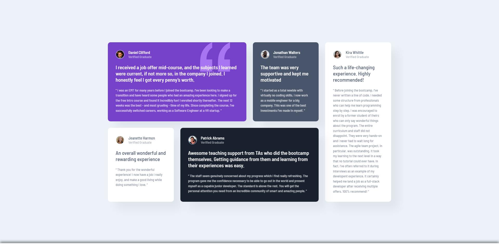

# Frontend Mentor - Testimonials grid section solution

This is a solution to the [Testimonials grid section challenge on Frontend Mentor](https://www.frontendmentor.io/challenges/testimonials-grid-section-Nnw6J7Un7). Frontend Mentor challenges help you improve your coding skills by building realistic projects.

## Table of contents

- [Overview](#overview)
  - [The challenge](#the-challenge)
  - [Screenshot](#screenshot)
  - [Links](#links)
- [My process](#my-process)
  - [Built with](#built-with)
  - [What I learned](#what-i-learned)
  - [Useful resources](#useful-resources)
- [Author](#author)

## Overview

### The challenge

Users should be able to:

- View the optimal layout for the site depending on their device's screen size

### Screenshot

### Links

- Solution URL: [Add solution URL here]([https://your-solution-url.com](https://www.frontendmentor.io/solutions/testimonials-grid-section-html-and-css-MyvSbLgkRx))
- Live Site URL: [franexmo81.github.io/testimonials-grid-section](https://franexmo81.github.io/testimonials-grid-section)

## My process

### Built with

- Semantic HTML5 markup
- CSS custom properties
- CSS Grid

### What I learned

- CSS fundamentals
- Responsive design
- CSS Grid

### Useful resources

- [W3Schools](https://www.w3schools.com/) - A must-go reference when it comes to know how a specific HTML tag or CSS property works.
- [A Complete Guide to CSS Grid](https://css-tricks.com/snippets/css/complete-guide-grid/) - A comprehensive guide to CSS grid layout.

## Author

- Website - [Fran Extremera](https://www.franextremera.com/)
- Frontend Mentor - [franexmo81](https://www.frontendmentor.io/profile/franexmo81)
- iCodeThis - [Fran](https://icodethis.com/Fran)
- LinkedIn - [Fran Extremera](https://www.linkedin.com/in/francisco-extremera/)
